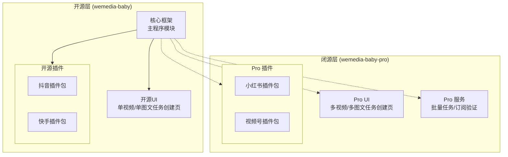

# 项目架构升级与开源策略方案 (v2.0)

> 版本: 2.1  
> 日期: 2026-02-09  
> 状态: 架构落地 (Implemented)

---

## 一、背景与目标

### 1.1 当前问题

| 问题                     | 影响                               |
| ------------------------ | ---------------------------------- |
| 平台逻辑硬编码在主程序中 | 平台规则变化需修改核心代码，风险高 |
| 开源粒度不够灵活         | 无法按平台独立开源/闭源            |
| 功能模块耦合紧密         | 难以单独维护和更新                 |

### 1.2 升级目标

1. **插件化架构**：平台逻辑完全解耦，支持热插拔
2. **灵活开源策略**：按平台和功能模块独立控制开源/闭源
3. **降低维护成本**：平台规则变化只需更新对应插件

---

## 二、架构设计

### 2.1 整体架构图



### 2.2 双仓库结构

```
GitHub Public: wemedia-baby/
├── src/
│   ├── core/                    # 核心框架 (开源)
│   │   ├── login_module.py      # 登录模块
│   │   ├── publish_module.py    # 发布模块
│   │   └── plugin_loader.py     # 插件加载器
│   │
│   ├── plugins/                 # 插件目录
│   │   ├── interfaces/          # 插件接口定义 (开源)
│   │   ├── douyin/              # 抖音插件 (开源)
│   │   └── kuaishou/            # 快手插件 (开源)
│   │
│   ├── ui/
│   │   └── pages/
│   │       ├── single_publish_page.py    # 单视频任务创建 (开源)
│   │       └── image_single_publish_page.py # 单图文任务创建 (开源)
│   │
│   └── infrastructure/          # 基础设施 (开源)
│
└── src/plugins_pro/         # Git Submodule → 私有仓库
    └── (包含小红书等Pro插件)

---

GitHub Private: wemedia-baby-pro/
├── src/plugins_pro/
├── xiaohongshu/             # 小红书插件 (闭源)
│   ├── login_plugin.py
│   ├── publish_plugin.py
│   └── selectors.py
│
└── wechat_video/            # 视频号插件 (闭源)
    └── ...
│
├── ui/
│   └── pages/
│       ├── batch_publish_page.py      # 多视频任务创建 (闭源)
│       └── image_batch_publish_page.py # 多图文任务创建 (闭源)
│
└── services/
    ├── batch/                   # 批量任务服务 (闭源)
    └── subscription/            # 订阅验证服务 (闭源)
```

---

## 三、发布逻辑说明

### 3.1 核心概念

| 概念             | 说明                                               |
| ---------------- | -------------------------------------------------- |
| **任务**         | 一个账号 + 一个视频/图文 + 发布参数 = 一个发布任务 |
| **任务创建页面** | 只负责创建任务，不负责执行发布                     |
| **任务列表页面** | 显示所有任务，执行发布操作                         |

### 3.2 任务创建方式

| 页面               | 功能                                | 示例   |
| ------------------ | ----------------------------------- | ------ |
| **单视频任务创建** | 选择1个账号 + 1个视频 → 生成1个任务 | 开源   |
| **单图文任务创建** | 选择1个账号 + 1组图片 → 生成1个任务 | 开源   |
| **多视频任务创建** | 选择N个账号 + N个视频 → 生成N个任务 | 🔒 Pro |
| **多图文任务创建** | 选择N个账号 + N组图片 → 生成N个任务 | 🔒 Pro |

> **示例**：多视频任务创建页面选择2个账号 + 导入2个视频 → 生成2个任务（账号A-视频1、账号B-视频2）

### 3.3 发布执行

任务列表页面点击"开始发布"后，按任务顺序依次执行发布操作。**任务列表页面所有功能完全开源**。

---

## 四、开源/闭源划分

### 4.1 开源内容

| 类别         | 模块                           | 说明                                             |
| ------------ | ------------------------------ | ------------------------------------------------ |
| **核心框架** | `src/core/*`                   | 登录模块、插件加载器                             |
| **插件接口** | `src/plugins/interfaces/*`     | `LoginPluginInterface`, `PublishPluginInterface` |
| **抖音插件** | `src/plugins/douyin/*`         | 登录插件、发布插件、选择器                       |
| **快手插件** | `src/plugins/kuaishou/*`       | 登录插件、发布插件、选择器                       |
| **任务创建** | `single_publish_page.py`       | 单视频任务创建页面                               |
| **任务创建** | `image_single_publish_page.py` | 单图文任务创建页面                               |
| **任务列表** | `publish_list_page.py`         | 发布任务列表页面 (含发布执行功能)                |
| **基础设施** | `src/infrastructure/*`         | 浏览器管理、文件管理、通用工具                   |

### 4.2 闭源内容

| 类别         | 模块                | 说明                          |
| ------------ | ------------------- | ----------------------------- |
| **Pro 插件** | `src/plugins_pro/*` | 小红书/视频号插件 (闭源目录)  |
| **Pro 源码** | `src/pro/*`         | Pro UI、服务与逻辑 (闭源目录) |

---

## 四、插件架构详细设计

### 4.1 插件目录结构

```
src/plugins/
├── __init__.py
├── plugin_manager.py           # 插件管理器 (支持双目录扫描)
│
├── interfaces/                 # 接口定义 (开源)
│   ├── __init__.py
│   ├── login_plugin.py         # 登录插件接口
│   └── publish_plugin.py       # 发布插件接口
│
├── douyin/                     # 抖音插件 (开源)
│   ├── __init__.py
│   ├── login_plugin.py         # 登录检测、Cookie提取、昵称提取
│   ├── publish_plugin.py       # 视频发布、图文发布
│   ├── selectors.py            # CSS选择器常量
│   └── config.json             # 平台URL、限制等配置
│
└── kuaishou/                   # 快手插件 (开源)
    └── (同上结构)

---

plugins_pro/                    # Git Submodule (闭源)
├── xiaohongshu/
└── wechat_video/
```

### 4.2 插件管理器 (支持双目录)

```python
# src/plugins/plugin_manager.py
class PluginManager:
    """插件管理器 - 支持开源插件和Pro插件双目录加载"""

    OPEN_SOURCE_DIR = Path(__file__).parent  # src/plugins/
    # src/plugins_pro
    PRO_PLUGINS_DIR = Path(__file__).parent.parent / "plugins_pro"

    @classmethod
    def initialize(cls):
        # 1. 加载开源插件
        cls._load_plugins_from_dir(cls.OPEN_SOURCE_DIR)

        # 2. 尝试加载Pro插件 (如果存在)
        if cls.PRO_PLUGINS_DIR.exists():
            cls._load_plugins_from_dir(cls.PRO_PLUGINS_DIR, "src.plugins_pro")
```

---

## 五、功能开关系统

### 5.1 功能开关配置

```python
# src/config/feature_flags.py

FEATURES = {
    # ===== 开源功能 (默认启用) =====
    'douyin_login': True,
    'douyin_publish': True,
    'kuaishou_login': True,
    'kuaishou_publish': True,
    'single_video_publish': True,
    'single_image_publish': True,

    # ===== Pro 功能 (需要订阅) =====
    'xiaohongshu_login': False,
    'xiaohongshu_publish': False,
    'wechat_video_login': False,
    'wechat_video_publish': False,
    'batch_video_publish': False,
    'batch_image_publish': False,
    'scheduled_publish': False,
}

def is_feature_enabled(feature: str) -> bool:
    """检查功能是否启用"""
    # 先检查本地配置
    if feature in FEATURES and FEATURES[feature]:
        return True

    # 再检查Pro订阅状态
    return is_pro_licensed() and feature.startswith(('xiaohongshu', 'wechat_video', 'batch'))
```

### 5.2 UI 动态显示

```python
# 导航栏动态显示平台
def get_available_platforms():
    platforms = []
    if is_feature_enabled('douyin_login'):
        platforms.append('douyin')
    if is_feature_enabled('kuaishou_login'):
        platforms.append('kuaishou')
    if is_feature_enabled('xiaohongshu_login'):
        platforms.append('xiaohongshu')
    if is_feature_enabled('wechat_video_login'):
        platforms.append('wechat_video')
    return platforms
```

---

## 六、开源策略

### 6.1 许可证选择

| 仓库                        | 许可证            | 说明                         |
| --------------------------- | ----------------- | ---------------------------- |
| **wemedia-baby** (开源)     | **Apache 2.0**    | 允许商业使用，需保留版权声明 |
| **wemedia-baby-pro** (闭源) | 商业许可证 (EULA) | 禁止分发、反编译             |

### 6.2 开源版功能

| 功能           | 状态        |
| -------------- | ----------- |
| 抖音账号登录   | ✅ 完整开源 |
| 抖音视频发布   | ✅ 完整开源 |
| 快手账号登录   | ✅ 完整开源 |
| 快手视频发布   | ✅ 完整开源 |
| 单视频任务创建 | ✅ 完整开源 |
| 单图文任务创建 | ✅ 完整开源 |
| 指纹浏览器     | ✅ 完整开源 |
| 账号管理基础   | ✅ 完整开源 |

### 6.3 Pro 版功能

| 功能           | 状态        |
| -------------- | ----------- |
| 小红书账号登录 | 🔒 Pro 专属 |
| 小红书笔记发布 | 🔒 Pro 专属 |
| 视频号账号登录 | 🔒 Pro 专属 |
| 视频号视频发布 | 🔒 Pro 专属 |
| 多视频任务创建 | 🔒 Pro 专属 |
| 多图文任务创建 | 🔒 Pro 专属 |
| 定时发布       | 🔒 Pro 专属 |
| 订阅管理       | 🔒 Pro 专属 |

---

## 七、实施路线图

| 阶段        | 任务                | 工期 | 产出                                  |
| ----------- | ------------------- | ---- | ------------------------------------- |
| **Phase 1** | 创建插件基础设施    | 1天  | ✅ 完成 (src/plugins, plugin_manager) |
| **Phase 2** | 实现抖音插件 (开源) | 2天  | ✅ 完成 (src/plugins/douyin)          |
| **Phase 3** | 实现快手插件 (开源) | 1天  | ✅ 完成 (src/plugins/kuaishou)        |
| **Phase 4** | 重构核心模块        | 2天  | 🔄 进行中 (main.py 迁移中)            |
| **Phase 5** | 创建Pro仓库结构     | 1天  | ✅ 完成 (src/plugins_pro)             |
| **Phase 6** | 迁移Pro功能         | 2天  | ✅ 完成 (小红书/视频号插件)           |
| **Phase 7** | 功能开关系统        | 1天  | ✅ 完成 (feature_flags.py)            |
| **Phase 8** | 测试与发布          | 2天  | ⏳ 待执行                             |

**总计：约 12 天**

---

## 八、Git 仓库配置

### 8.1 主仓库 .gitmodules

```
[submodule "plugins_pro"]
    path = src/plugins_pro
    url = git@github.com:your-org/wemedia-baby-pro.git
    branch = main
```

### 8.2 开源版 .gitignore

```
# Pro 功能目录
src/plugins_pro/

# 敏感配置
config/license.key
config/pro_config.json
```

### 8.3 发布流程

1. **日常开发**：在 `wemedia-baby` 主仓库开发
2. **Pro 功能**：在 `wemedia-baby-pro` 私有仓库开发
3. **同步关联**：通过 Git Submodule 关联
4. **开源发布**：主仓库 Push 到 GitHub Public
5. **Pro 发布**：打包包含 Submodule 的完整版本

---

## 九、风险与对策

| 风险           | 对策                          |
| -------------- | ----------------------------- |
| 开源代码被滥用 | Apache 2.0 需保留版权，可追溯 |
| Pro 代码泄露   | 关键验证逻辑在服务端          |
| 插件接口不稳定 | 定义版本号，保持向后兼容      |
| 社区维护成本   | 设定 Issue 模板和贡献指南     |

---

## 十、附录

### 10.1 开源文件清单

```
src/
├── core/
│   ├── login_module.py
│   ├── publish_module.py
│   └── plugin_loader.py
├── plugins/
│   ├── interfaces/
│   │   ├── login_plugin.py
│   │   └── publish_plugin.py
│   ├── douyin/
│   │   ├── login_plugin.py
│   │   ├── publish_plugin.py
│   │   └── selectors.py
│   └── kuaishou/
│       ├── login_plugin.py
│       ├── publish_plugin.py
│       └── selectors.py
├── ui/pages/
│   ├── single_publish_page.py
│   └── image_single_publish_page.py
├── infrastructure/
│   └── (全部开源)
└── utils/
    └── (全部开源)
```

### 10.2 闭源文件清单

```
plugins_pro/
├── xiaohongshu/
├── wechat_video/
└── ...

src/pro/
├── ui/pages/
│   ├── batch_publish_page.py
│   └── image_batch_publish_page.py
└── services/
    ├── batch/
    └── subscription/
```
