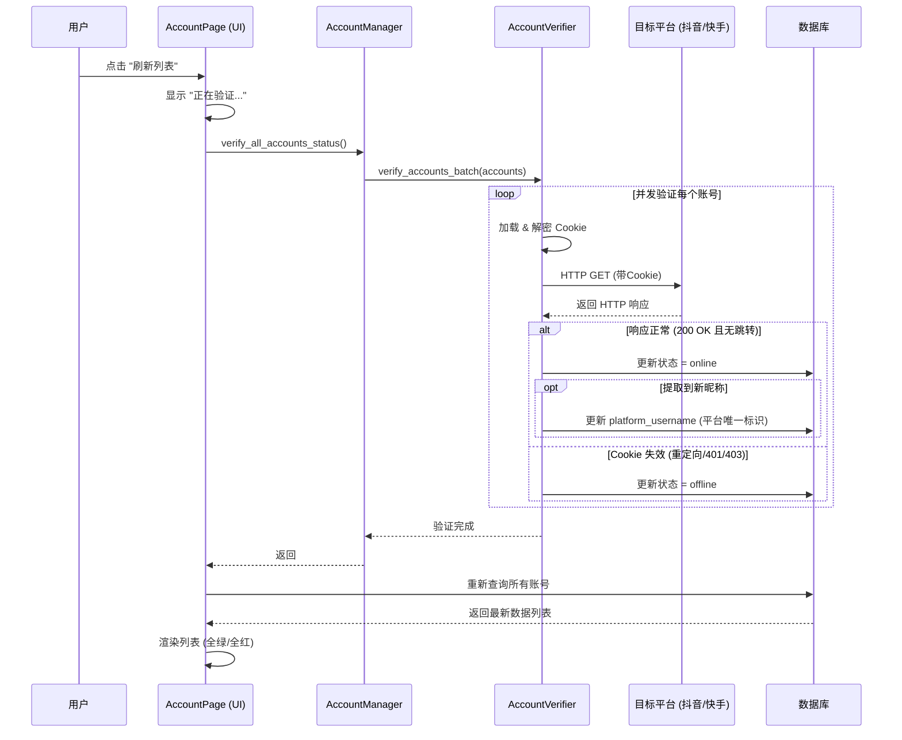

# 账号列表刷新功能实现原理

> 文档版本：1.1
> 更新时间：2026-03-01
> 适用模块：账号管理 (Account Management)

本文档详细说明了“刷新列表”功能的实现原理、状态判定逻辑以及如何扩展到其他平台。此文档旨在帮助开发人员理解现有逻辑并在未来复用。

## 1. 核心原理 (Core Concepts)

账号状态的刷新经历了两个阶段的演变：

- **V1 (旧方案)**: 基于**本地 Cookie 文件存在性**检查。
  - _逻辑_：只要文件夹里有 `.encrypted` 文件，就认为是“在线”。
  - _缺点_：无法识别 Cookie 过期、服务端强制下线等情况。
- **V2 (当前方案)**: 基于**HTTP 主动验证**。
  - _逻辑_：加载本地 Cookie，向目标平台（如抖音创作者中心）发起真实的 HTTP 请求，根据响应状态码和内容判定是否有效。同时自动同步最新的昵称。
  - _优点_：准确反映真实在线状态。

## 2. 架构设计 (Architecture)

刷新功能涉及以下几个核心组件：

### 2.1 UI 层 (`AccountPage`)

- **触发入口**: 用户点击“刷新列表”按钮 (`_on_refresh`)。
- **职责**:
  1.  显示“正在验证...”进度条。
  2.  调用后端服务的 `verify_all_accounts_status` 方法。
  3.  等待异步任务完成。
  4.  重新从数据库加载最新数据并渲染列表。

### 2.2 服务层 (`AccountManagerAsync`)

- **职责**: 作为外观模式 (Facade)，对外提供统一接口。
- **关键代码**:

  ```python
  async def verify_all_accounts_status(self):
      # 懒加载验证器
      if not self.verifier:
          self.verifier = AccountVerifier(self)

      # 获取所有账号并批量验证
      accounts = await self.get_accounts()
      await self.verifier.verify_accounts_batch(accounts)
  ```

### 2.3 验证核心 (`AccountVerifier`)

- **文件路径**: `src/services/account/account_verifier.py`
- **职责**: 执行具体的 HTTP 请求验证逻辑。
- **关键流程**:
  1.  **加载 Cookie**: 安全解密本地 Cookie 文件。
  2.  **构建请求**: 设置 User-Agent 和 Cookie 头。
  3.  **发起请求**: 访问各平台的验证 URL（如 `https://creator.douyin.com/creator-micro/home`）。
  4.  **判定逻辑**:
      - **重定向检测**: 如果跳转到 `/login` 或 `/passport` -> **判定离线**。
      - **内容检测**: 如果页面包含“扫码登录”、“立即登录” -> **判定离线**。
      - **API 验证 (高阶)**: 对抖音等平台，进一步调用 `/user/info/` API，若返回 JSON 数据且包含用户信息 -> **判定在线** 并 **提取昵称**。
  5.  **更新状态**: 将验证结果（online/offline）和最新昵称写回数据库。

## 3. 详细流程图 (Workflow)



## 4. 如何复用与扩展 (Extension)

如果您需要支持新的平台（例如 B站、知乎），只需修改 `AccountVerifier` 类：

1.  **定位文件**: `src/services/account/account_verifier.py`
2.  **修改 `verify_account_by_http` 方法**:
    - 添加新的 `elif platform == 'bilibili':` 分支。
    - 设置 **验证URL** (`verify_url`): 选择一个只有登录后才能访问的页面，如创作中心主页。
    - (可选) 设置 **API URL**: 如果有获取用户信息的 JSON API 更佳。
3.  **定义失效特征**:
    - 确定未登录时跳转的 URL 特征 (如 `passport.bilibili.com/login`).
    - 确定未登录时页面显示的关键词 (如 "请登录", "注册").

### 代码示例

```python
if platform == 'new_platform':
    verify_url = 'https://member.new-platform.com/studio'
    # ... 发起请求 ...
    if 'login.html' in response.url:
        return {'is_valid': False}
```

## 5. 常见问题 (FAQ)

- **Q: 为什么刷新这么慢？**
  - A: 为了准确性，系统对每个账号都发起了一次真实的网络请求。如果账号较多或网络不佳，耗时会增加。系统采用了 `asyncio` 并发处理 (`max_workers=5`) 来加速。
- **Q: 为什么有的账号验证通过但打开浏览器还是未登录？**
  - A: 极少数情况下，Cookie 可能包含主要凭证但缺少某些次要凭证。或者浏览器环境指纹与 HTTP 请求指纹差异过大导致风控。
