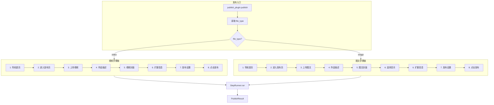
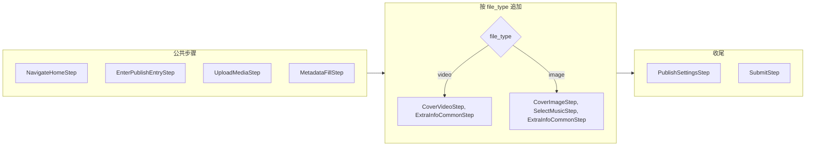
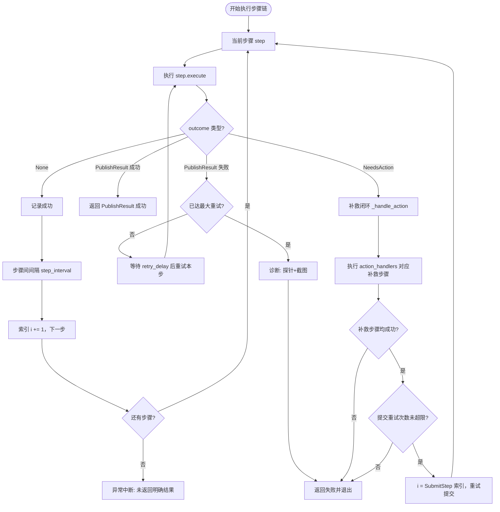
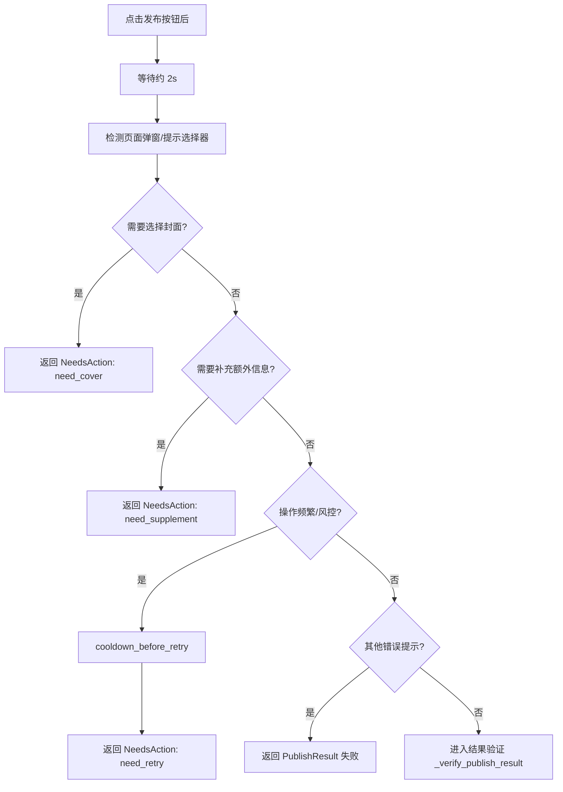
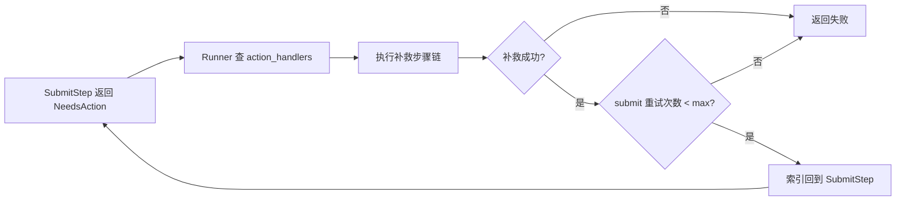

# 3.2 抖音发布流程图

> **目的**：便于理解代码中抖音发布流程的**执行顺序**、**分支逻辑**与**补救机制**。  
> **源码入口**：`src/plugins/community/douyin/publish_plugin.py` → `DouyinPublishPlugin.publish()`

---

## 1. 总览：从入口到步骤链

发布流程由 **发布插件** 组装步骤链，交给 **StepRunner** 顺序执行；步骤链根据 `metadata["file_type"]` 在**视频 / 图文**之间分支。

**逻辑要点**：

- **统一前缀**：无论视频还是图文，前 4 步均为：导航首页 → 进入发布页 → 上传 → 作品描述。
- **分支点**：第 5、6 步按 `file_type` 分支：
  - **video**：封面（CoverVideoStep）→ 扩展信息（ExtraInfoCommonStep）。
  - **image**：封面（CoverImageStep）→ 选择音乐（SelectMusicStep）→ 扩展信息（ExtraInfoCommonStep）。
- **统一收尾**：第 7、8 步（发布设置、点击发布）两种类型共用。

---

## 2. 步骤链组装逻辑（代码对应）

组装发生在 `publish_plugin.py` 的 `publish()` 内，逻辑如下。

| 步骤顺序 | 视频 (video) | 图文 (image) | 说明 |
|----------|--------------|--------------|------|
| 1 | NavigateHomeStep | 同左 | 导航创作者首页 |
| 2 | EnterPublishEntryStep | 同左 | 点击「发布视频」或「发布图文」 |
| 3 | UploadMediaStep | 同左 | 上传视频文件 或 多图 |
| 4 | MetadataFillStep | 同左 | 标题、描述、话题标签 |
| 5 | CoverVideoStep | CoverImageStep | 视频封面 / 图文封面 |
| 6 | ExtraInfoCommonStep | SelectMusicStep → ExtraInfoCommonStep | 扩展信息；图文多一步选音乐 |
| 7 | PublishSettingsStep | 同左 | 定时发布等（可选） |
| 8 | SubmitStep | 同左 | 点击发布并校验结果 |

---

## 3. StepRunner 执行与判断逻辑

StepRunner 按顺序执行步骤，并根据每一步的**返回值类型**决定：继续下一步、重试本步、补救后重试提交，或直接结束（成功/失败）。

### 3.1 步骤返回值类型（StepOutcome）

| 返回值 | 含义 | Runner 行为 |
|--------|------|-------------|
| `None` | 本步成功 | 执行步骤间间隔（防风控），然后执行下一步 |
| `PublishResult(success=True)` | 流程结束且成功 | 直接返回该结果 |
| `PublishResult(success=False)` | 本步失败 | 若未达最大重试次数则重试本步，否则返回失败并退出 |
| `NeedsAction(action=...)` | 需补救（仅 Submit 步骤会返回） | 见下文「补救闭环」 |

### 3.2 Runner 主循环逻辑

**配置要点**（`step_runner.py` 中 `RunnerConfig`）：

- `max_step_retries`：单步最大重试次数（默认 3）。
- `step_retry_delay_seconds`：步骤重试间隔（默认 1.5 秒）。
- `max_submit_retries`：NeedsAction 补救后，重新执行 Submit 的最大次数（默认 2）。

---

## 4. 步骤 8（Submit）的决策与补救

点击发布后，Submit 步骤会做**结果检测**，可能返回 `NeedsAction` 或 `PublishResult`，从而驱动 Runner 的补救或结束。

### 4.1 点击前

- 用选择器找发布按钮；找不到 → 返回 `PublishResult(success=False)`。
- 若按钮为 disabled（如转码中），轮询等待最多约 180 秒；超时 → 返回失败。

### 4.2 点击后检测（弹窗/提示）

### 4.3 结果验证（_verify_publish_result）

- **方式 1**：等待 URL 变为 `**/manage/**`，并可选检查管理页特征元素 → 成功。
- **方式 2**：页面上存在「发布成功」类提示 → 成功。
- **方式 3**：URL 已离开 upload 且仍在 creator.douyin.com，且页面有 nav 等 → 推测成功。
- 以上都不满足 → 返回 `PublishResult(success=False, error_message=...)`。

### 4.4 补救闭环（NeedsAction → 补救步骤 → 重试提交）

当 Submit 返回 `NeedsAction` 时，Runner 不会重试「当前步骤」本身，而是：

1. 根据 `action` 从 `action_handlers` 取出对应的**补救步骤列表**。
2. 顺序执行这些补救步骤；任一步失败则整体返回失败。
3. 补救全部成功后，若未超过 `max_submit_retries`，将步骤索引 `i` 设回 **SubmitStep**，重新执行步骤链从 Submit 开始（即再次点击发布）。
4. 若已超过 `max_submit_retries`，返回失败。

| action | 视频 (video) 补救步骤 | 图文 (image) 补救步骤 |
|--------|------------------------|------------------------|
| need_cover | [CoverVideoStep] | [CoverImageStep] |
| need_supplement | [ExtraInfoCommonStep] | [SelectMusicStep, ExtraInfoCommonStep] |
| need_retry | （仅重试提交，不插步骤） | 同左 |

---

## 5. 各步骤内部逻辑简表

| 步骤 | 主要判断与行为 |
|------|----------------|
| **1 导航首页** | 打开首页 URL → 检测风控弹窗/登录文案 → 不在创作者域则失败 |
| **2 进入发布页** | 按 file_type 选「发布视频」或「发布图文」按钮 → 点击 → 用发布页特征选择器确认进入 |
| **3 上传** | file_type=video：找文件 input 或上传按钮，上传后轮询「重新上传/上传成功」等；file_type=image：多图 set_input_files 或 file chooser，轮询缩略图数量 |
| **4 作品描述** | 填标题（拟人输入）、描述+话题（contenteditable），找不到编辑器则跳过不阻断 |
| **5 视频封面** | cover_type：ai → 主页面直接选 AI 推荐；first_frame/custom → 点封面入口，弹窗内选首帧或上传 cover_path |
| **5 图文封面** | 逻辑与视频封面类似，使用图文对应选择器 |
| **6 选择音乐** | 图文专属；当前占位，按 metadata 可选 music_keyword，直接返回 None 不阻断 |
| **6 扩展信息** | 检测「补充信息」弹窗，点击确定/确认/完成等按钮关闭，不阻断 |
| **7 发布设置** | 若有 schedule_time 则尝试点「定时」并填时间，找不到则跳过 |
| **8 点击发布** | 见上文：找按钮、等可用、点击 → 检测弹窗 → NeedsAction 或 _verify_publish_result |

---

## 6. 文件与流程图对应关系

| 代码文件 | 在流程图中的位置 |
|----------|------------------|
| `publish_plugin.py` | 总览中的「发布入口」、步骤链组装、action_handlers 定义 |
| `steps/step_runner.py` | StepRunner 主循环、重试、NeedsAction 补救、诊断 |
| `steps/_base.py` | StepOutcome 类型定义（None / PublishResult / NeedsAction） |
| `steps/step_01_home.py` ~ `step_08_submit.py` | 各步骤节点及步骤内分支逻辑 |

结合本文档与《3.1 抖音插件功能介绍》可完整理解抖音发布在代码中的**执行顺序、分支与补救逻辑**。
