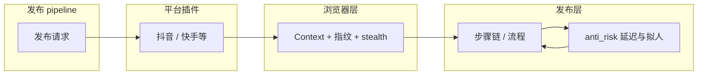

# 防风控机制：集成到各平台插件 vs 抽离复用

> **文档版本**：v1.1  
> **更新日期**：2026-03-01  
> **目的**：扩展快手、小红书等多平台时，防风控逻辑是放在各自插件里，还是抽成公共能力复用？本文做对比与推荐。

---

## 项目防风控总览

项目防风控包含**浏览器层**（环境级抗检测）与**发布层**（行为级延迟/拟人/冷却），二者在同一发布链路中同时生效：发布请求经 pipeline 进入各平台插件后，在已具备浏览器层防风控的 Context/Page 上执行步骤，步骤与流程中调用发布层 anti_risk 能力，形成「环境 + 行为」双重防风控。

| 层级         | 职责                                                              | 主要文件                                                 | 配置来源                                             | 详见       |
| ------------ | ----------------------------------------------------------------- | -------------------------------------------------------- | ---------------------------------------------------- | ---------- |
| **浏览器层** | 让浏览器/页面“看不出是自动化”（指纹、stealth、启动参数）          | `browser_manager.py`、`profile_manager.py`、`stealth.js` | ProfileManager / 账号或应用配置                      | 第 5 节    |
| **发布层**   | 让操作节奏“像真人”（延迟、步骤间间隔、拟人点击/输入、频繁后冷却） | `src/infrastructure/anti_risk/`、`human_behavior.py`     | `config/platforms/{platform}.json` 的 `anti_risk` 块 | 第 3、6 节 |



---

## 1. 防风控涉及的能力拆解

| 能力                      | 是否与具体平台强相关 | 说明                                                                            |
| ------------------------- | -------------------- | ------------------------------------------------------------------------------- |
| 随机延迟 / 抖动           | 否                   | 数学与行为一致：`base_ms * speed_rate * (1 ± jitter)`，各平台都需要“别固定节奏” |
| 步骤间最小间隔            | 否                   | 概念通用；具体“间隔多少秒”可配成平台参数                                        |
| 发布速度倍率 speed_rate   | 否                   | 已由 pipeline 传 metadata，各插件统一用即可                                     |
| 「操作频繁」后冷却再重试  | 半                   | **检测**“频繁”是平台相关的（文案/选择器）；**冷却等待 + 重试**的流程可复用      |
| 风控/账号异常检测         | 是                   | 各平台弹窗文案、选择器不同（抖音“账号异常”，快手/小红书各异）                   |
| 滑块/验证码检测与提示     | 是                   | 各平台 UI 不同，仅“检测到后返回明确原因 + 建议”的模式可统一                     |
| 同账号发布间隔 / 单日上限 | 否                   | 与具体发布页 DOM 无关，属于任务调度层，应放在 pipeline 或执行层                 |

结论：**“怎么等、怎么节流”可复用；“哪里算风控、哪里算频繁”必须各平台自己认。**

---

## 2. 两种方案对比

### 方案 A：集成到各自平台插件中

- **做法**：抖音、快手、小红书各自在 steps 或 publish 里实现随机延迟、步骤间隔、频繁后冷却等。
- **优点**：改一个平台不影响其他；实现自由，可快速试错。
- **缺点**：逻辑重复；行为不统一（有的有随机抖动、有的没有）；后续统一加“同账号间隔”等要改多份。

### 方案 B：抽离成独立功能，多平台复用

- **做法**：把“延迟与节流”抽成公共模块（如 `anti_risk` 或 `publish_delays`），各插件只做“风控/频繁的检测”并**调用**公共能力。
- **优点**：行为一致、易维护、一次优化多平台受益；同账号间隔/单日上限等可放在 pipeline 一层，与插件解耦。
- **缺点**：需要约定各插件对公共模块的调用方式与配置形态；平台极特殊逻辑仍可在插件内做补充。

---

## 3. 推荐：抽离 + 各平台配置与检测（混合）

建议采用 **“公共能力抽离 + 各平台只做检测与配置”** 的混合方式。

### 3.1 公共层（与平台无关，复用）

建议新增或归到现有基础设施/服务下，例如：

- **位置**：`src/infrastructure/anti_risk/` 或 `src/services/publish/anti_risk/`（与现有结构二选一即可）。
- **提供能力**：
  - **随机延迟**：`async def random_delay(page, base_ms, metadata)`  
    内部读取 `metadata["speed_rate"]`，计算 `base_ms * speed_rate * (0.8 + 0.4 * random.random())` 并 `wait_for_timeout`，供各步骤调用。
  - **步骤间间隔**：`async def step_interval(metadata, config)`  
    配置如 `{ "base_seconds": 2, "jitter_seconds": 3 }`，步骤结束后由 Runner 或各步骤末尾调用，避免“每步结束立刻下一步”。
  - **频繁后冷却**：`async def cooldown_before_retry(seconds)`  
    检测到“操作频繁”后，在重试提交前等待 N 秒（N 由平台配置传入），可带简单日志“冷却中，N 秒后重试”。
- **（可选）Pipeline 级**：同账号两次发布的最小间隔、单账号单日发布上限，放在 **publish pipeline / 执行层** 的 filter 或调度逻辑里，不放在插件内部，这样与平台无关、所有平台统一生效。

### 3.2 各平台插件内（平台相关）

- **仍由各平台负责**：
  - 风控/账号异常/登录失效的 **DOM 或文案检测**（用各自 `selectors.py` / 文案列表）。
  - “操作频繁”“操作过快”的 **检测**（谁家 toast 文案、选择器就写谁家）。
  - 检测到后：返回 `PublishResult(success=False, error_message=...)` 或 `NeedsAction`；若要做“冷却后重试”，则**调用**公共层的 `cooldown_before_retry(平台配置的秒数)`，再重试提交。
- **配置**：每个平台在 `config/platforms/{platform}.json`（或插件自己的 config）里增加一小块防风控参数，例如：
  - `cooldown_after_frequent_seconds`
  - `step_interval_base_seconds` / `step_interval_jitter_seconds`
  - `delay_jitter_ratio`（随机范围）
    公共层读取这些配置即可，无需写死平台名。

### 3.3 调用关系示意

```text
[ 发布 pipeline / 执行层 ]
         │
         ▼
[ 各平台 publish 插件 ]  ← 传入 metadata（含 speed_rate）、平台风控配置
         │
         ├─ 步骤中/提交前：调用 公共 random_delay / step_interval
         ├─ 检测到「频繁」：调用 公共 cooldown_before_retry(config 的秒数)，再重试
         └─ 检测到风控/登录异常：直接返回失败（平台自己的文案与选择器）
```

这样：**“等多久、怎么抖、冷却多久”在公共层；“算不算频繁、算不算风控”在插件层。**

---

## 4. 小结

| 问题                                 | 建议                                                                               |
| ------------------------------------ | ---------------------------------------------------------------------------------- |
| 防风控机制放在各平台插件里还是抽离？ | **抽离成独立可复用功能**，各平台只做“检测 + 配置 + 调用”。                         |
| 哪些抽离？                           | 随机延迟、步骤间间隔、频繁后冷却等待、以及（可选）同账号/单日限速放在 pipeline。   |
| 哪些留在插件？                       | 风控/频繁/登录的 **检测**（选择器、文案）与返回结果形态；平台特有的滑块/验证提示。 |
| 扩展快手、小红书时                   | 复用同一套 delay/interval/cooldown，只为新平台加 selectors 与风控配置即可。        |

按上述方式，防风控机制**既统一又可扩展**，后续加新平台时主要做“检测与配置”，不必再写一遍节流与冷却逻辑。

---

## 5. Undetected Playwright 的防风控功能及与发布防风控的结合

软件发布流程实际使用的是 **UndetectedBrowserManager**（账号绑定的持久化浏览器），不是单独的 `UndetectedPlaywrightBrowser`。浏览器层的“防风控”主要是**环境级抗检测**（让页面认为这是正常用户浏览器），与发布步骤里的**行为级防风控**（延迟、间隔、冷却）是两层，可以也应当结合使用。

### 5.1 浏览器层防风控所在文件与职责

| 文件                                                          | 职责                                                                                                                                                                        |
| ------------------------------------------------------------- | --------------------------------------------------------------------------------------------------------------------------------------------------------------------------- |
| `src/infrastructure/browser/browser_manager.py`               | **UndetectedBrowserManager**：启动持久化 Context、应用启动参数、注入 stealth 脚本；发布时由 `publish_executor` 取得其 `context` 作为 Page 传给各平台插件。                  |
| `src/infrastructure/browser/profile_manager.py`               | **ProfileManager**：按账号管理 `user_data_dir`；生成/加载**指纹配置**（UA、screen、WebGL、Battery、Connection、Canvas 种子等），供 `browser_manager` 启动与注入脚本时使用。 |
| `src/resources/scripts/stealth/stealth.js`                    | **抗检测脚本模板**：在页面加载前注入，伪造 `navigator.webdriver`、硬件/屏幕/WebGL/Navigator/权限等，降低自动化特征。                                                        |
| `src/infrastructure/browser/undetected_playwright_browser.py` | **UndetectedPlaywrightBrowser**：另一套封装，内联一段简单抗检测脚本；当前工厂**统一返回 BrowserManager**，发布链路不直接使用此类，仅作备用或历史方案。                      |
| `src/infrastructure/browser/browser_factory.py`               | **BrowserFactory**：根据配置返回浏览器实例；当前 `get_browser_service` 固定返回 `UndetectedBrowserManager`。                                                                |

### 5.2 浏览器层具体配置与能力

**1）启动参数**（`browser_manager._get_launch_args()`）

- `--disable-blink-features=AutomationControlled`：去掉“自动化控制”特征。
- `--exclude-switches=enable-automation`：不暴露自动化开关。
- `--no-sandbox`、`--disable-dev-shm-usage`、`--ignore-certificate-errors`、`--disable-infobars` 等。
- WebRTC 相关：`--webrtc-ip-handling-policy=...`、`--disable-webrtc-hw-encoding/decoding`。
- 使用本地 Chrome：`channel = "chrome"`。

**2）指纹配置**（`profile_manager.get_fingerprint()` / `_generate_default_fingerprint()`）

- **User-Agent**：未配置时在 BrowserManager 中从 UA 模板池随机生成并持久化。
- **Screen**：width/height/availWidth/availHeight/colorDepth/pixelDepth。
- **WebGL**：vendor、renderer（多种显卡型号随机）。
- **Navigator**：platform、maxTouchPoints、vendor、vendorSub、productSub。
- **硬件**：hardwareConcurrency、device_memory。
- **Battery**：charging、level。
- **Connection**：effectiveType、downlink、rtt。
- **Canvas / AudioContext**：噪声种子，保证同账号指纹一致。
- **Locale / 时区**：zh-CN、Asia/Shanghai。

**3）Stealth 脚本**（`stealth.js` + `browser_manager._inject_stealth_scripts()`）

- 从 `PathManager.get_resource_dir() / "src" / "resources" / "scripts" / "stealth" / "stealth.js"` 读取模板。
- 将占位符（如 `__HARDWARE_CONCURRENCY__`、`__SCREEN_WIDTH__`、`__WEBGL_VENDOR__` 等）替换为当前账号指纹值后，通过 `context.add_init_script(stealth_script)` 注入。
- 脚本内容涵盖：隐藏/伪造 webdriver、硬件参数、屏幕、WebGL、Navigator、Battery、Connection、Permissions、MediaDevices、Intl、CDP/Headless 等（具体以 `stealth.js` 为准），实现“环境像真人浏览器”。

**4）Context 选项**

- `viewport=None`、`no_viewport=True`：不固定视口，更接近真实窗口。
- `user_agent`、`locale`、`timezone_id`、`permissions`、`ignore_https_errors` 等均由指纹或固定配置传入。

### 5.3 与发布防风控能否结合、如何结合

可以且应当结合，分工如下：

| 层级       | 做什么                                       | 在哪里                                                             |
| ---------- | -------------------------------------------- | ------------------------------------------------------------------ |
| **环境级** | 让浏览器/页面“看不出是自动化”                | UndetectedBrowserManager + ProfileManager + stealth.js（上述文件） |
| **行为级** | 让操作节奏“像真人”（延迟、间隔、频繁后冷却） | 发布步骤/公共 anti_risk 模块（见第 3 节）                          |

结合方式：

1. **同一条链路**：发布时 `publish_executor` 拿到的已是带 stealth 与指纹的 **同一 Context**，插件拿到的 `page` 就运行在“已防风控”的环境里，无需再为发布单独开一套浏览器。
2. **行为补环境**：环境再像真人，若请求过于密集、节奏过固定，仍可能触发“操作频繁”等。在步骤中引入**随机延迟、步骤间间隔、频繁后冷却**（第 3 节公共层 + 各平台检测），与浏览器层一起形成“环境 + 行为”双重防风控。
3. **配置分离**：
   - 浏览器/指纹相关：继续在 **ProfileManager / 账号或应用配置** 中维护。
   - 发布节奏相关：放在 **平台风控配置**（如 `config/platforms/douyin.json` 的 cooldown、step_interval、jitter）和公共 anti_risk 中。  
     两处配置互不替代，一起生效。

**结论**：Undetected Playwright（实际即 UndetectedBrowserManager + 指纹 + stealth.js）负责**环境级**防风控，所在文件即上文 5.1；发布侧的**行为级**防风控（延迟/间隔/冷却）在插件与公共层。两者在同一发布流程中同时使用即可结合，无需合并到同一套代码里。

---

## 6. 发布层防风控能力清单与高级功能

本节汇总**发布层**可用的防风控能力、所在文件、配置项及在步骤链中的调用建议，便于各平台插件统一接入并扩展（如模拟人工鼠标随机移动、步骤前随机浏览等高级功能）。

### 6.1 能力清单与所在文件

| 能力                     | 说明                                                        | 所在文件                                                               | 与 HumanBehavior 关系                                        |
| ------------------------ | ----------------------------------------------------------- | ---------------------------------------------------------------------- | ------------------------------------------------------------ |
| **随机延迟**             | 带 `speed_rate` 与随机抖动的等待，避免固定节奏              | `src/infrastructure/anti_risk/delays.py` → `random_delay()`            | 无依赖                                                       |
| **操作级延迟**           | 单次操作（点击、输入、滚动）前 1–5 秒随机延迟，避免固定间隔 | 同上 → `operation_delay()`                                             | 无依赖                                                       |
| **步骤间间隔**           | 步骤结束后最小间隔（基准 + 随机），流程自然化               | 同上 → `step_interval()`                                               | 无依赖                                                       |
| **频繁后冷却**           | 检测到「操作频繁」后等待 N 秒再重试                         | 同上 → `cooldown_before_retry()`                                       | 无依赖                                                       |
| **模拟人工鼠标随机移动** | 在视口内随机两点间贝塞尔曲线移动，模拟无目的移动            | `src/infrastructure/anti_risk/human_like.py` → `random_mouse_wander()` | 内部调用 `HumanBehavior.mouse_move()`                        |
| **步骤前随机浏览**       | 以一定概率执行轻微滚动或随机鼠标移动 + 短暂停留             | 同上 → `optional_browse_before_action()`                               | 内部调用 `HumanBehavior.scroll()` 与 `random_mouse_wander()` |
| **拟人点击**             | 在按钮有效区域内随机选点，贝塞尔轨迹移动后点击              | 同上 → `human_click()`                                                 | 内部调用 `HumanBehavior.click_in_bounds()`                   |
| **拟人输入**             | 标题/描述等逐字输入节奏，可选打错再删，避免瞬间粘贴         | 同上 → `human_type_text()`                                             | 内部调用 `HumanBehavior.type_text()`                         |

底层拟人行为（贝塞尔曲线、区域内随机点击、逐字输入、平滑滚动等）由 **`src/infrastructure/browser/human_behavior.py`** 的 `HumanBehavior`（含 `mouse_move`、`click_in_bounds`、`type_text`、`scroll` 等）提供；anti_risk 层负责**何时调用、是否启用、参数从配置读取**，与平台步骤解耦。

### 6.2 建议配置项（平台风控配置）

各平台可在 `config/platforms/{platform}.json` 或插件自己的 config 中增加下列项，由公共层或步骤读取：

| 配置项                            | 含义                                          | 典型值 | 使用处                                                  |
| --------------------------------- | --------------------------------------------- | ------ | ------------------------------------------------------- |
| `delay_jitter_ratio`              | 随机延迟的抖动范围（±比例，如 0.2 表示 ±20%） | 0.2    | `random_delay()`                                        |
| `step_interval_base_seconds`      | 步骤间间隔基准（秒）                          | 2      | `step_interval()`                                       |
| `step_interval_jitter_seconds`    | 步骤间间隔随机加量（秒）                      | 2      | `step_interval()`                                       |
| `cooldown_after_frequent_seconds` | 检测到「操作频繁」后冷却秒数                  | 180    | 插件检测到频繁后调用 `cooldown_before_retry(seconds)`   |
| `enable_human_like`               | 是否启用拟人行为总开关                        | true   | `random_mouse_wander` / `optional_browse_before_action` |
| `enable_mouse_wander`             | 是否启用随机鼠标移动                          | true   | `random_mouse_wander()`                                 |
| `enable_browse_before_action`     | 是否启用步骤前随机浏览                        | true   | `optional_browse_before_action()`                       |
| `browse_probability`              | 步骤前执行随机浏览的概率（0~1）               | 0.4    | `optional_browse_before_action()`                       |
| `operation_delay_min_seconds`     | 操作级延迟下限（秒），如点击/输入/滚动前      | 1      | `operation_delay()`                                     |
| `operation_delay_max_seconds`     | 操作级延迟上限（秒）                          | 5      | `operation_delay()`                                     |
| `operation_delay_before_click`    | 拟人点击前是否先做操作延迟                    | true   | `human_click()`                                         |
| `operation_delay_before_type`     | 拟人输入前是否先做操作延迟                    | true   | `human_type_text()`                                     |
| `type_mistake_probability`        | 拟人输入时模拟打错再删的概率（0~1）           | 0.02   | `human_type_text()`                                     |

单次任务可通过 `metadata["speed_rate"]` 控制整体节奏；`metadata["anti_risk_human_like"] = False` 可关闭当次拟人行为。

### 6.3 在步骤链中的调用时机建议

- **每步结束**：调用 `step_interval(page, metadata, config)`，避免「一步结束立刻下一步」，实现**流程自然化**。
- **单次操作前**（点击、输入、滚动）：调用 `operation_delay(page, metadata, config)`，为每次操作加入 1–5 秒随机延迟，避免固定间隔。
- **点击按钮时**：用 `human_click(page, selector, metadata, config)` 替代 `page.click(selector)`，在按钮有效区域内随机选点并贝塞尔轨迹移动后点击。
- **输入标题/描述时**：用 `human_type_text(page, selector, text, metadata, config)` 替代 `page.fill()`，模拟逐字输入节奏。
- **关键步骤前**（如进入发布页后、上传前、点击发布前）：
  - 先调用 `optional_browse_before_action(page, metadata, config)`（按概率做随机鼠标/轻微滚动 + 停留）；
  - 需要更强「像人在看页面」时，可再调用 `random_mouse_wander(page, metadata, config)`。
- **步骤内需要等待时**：用 `random_delay(page, base_ms, metadata, config)` 替代固定 `page.wait_for_timeout(base_ms)`。
- **检测到「操作频繁」**：由平台插件识别文案/选择器后，调用 `cooldown_before_retry(平台配置的秒数, reason="操作频繁")`，再重试提交。

按上述方式接入，发布层即可在**延迟与节流**基础上，叠加**操作随机化**（延迟控制、鼠标轨迹、随机点击位置、逐字输入）与**流程自然化**（步骤间间隔、操作间延迟），并与第 3、5 节的公共层、浏览器层防风控一起形成完整方案。

### 6.4 发布层行为层面：操作随机化与流程自然化（设计要点）

**操作随机化**

- **延迟控制**：所有操作（点击、输入、滚动）加入 1–5 秒的随机延迟，避免固定间隔。通过 `operation_delay()` 实现，可配置 `operation_delay_min_seconds` / `operation_delay_max_seconds`，并受 `speed_rate`、`delay_jitter_ratio` 影响。
- **鼠标轨迹**：模拟人类鼠标移动轨迹，而非直接瞬移到目标。使用 `HumanBehavior.mouse_move()` 结合贝塞尔曲线生成自然轨迹；`human_click()` 在点击前会从视口内随机起点移动到元素内随机目标点。
- **点击位置**：点击按钮时在按钮有效区域内随机选择坐标，而非固定中心点。由 `HumanBehavior.click_in_bounds()` 实现内缩边距后随机选点，再贝塞尔移动 + 点击；发布步骤统一通过 `human_click()` 调用。
- **输入模拟**：视频标题、描述等文本输入时，模拟逐字输入的节奏（含大小写/数字略慢、可选打错再删），而非瞬间粘贴。由 `HumanBehavior.type_text()` 实现，发布步骤通过 `human_type_text()` 调用，可配置 `type_mistake_probability`。

**流程自然化**

- 发布流程每个步骤间加入随机延迟，避免跳过中间环节。步骤结束后调用 `step_interval()`（基准 + 随机秒数）；单次操作前调用 `operation_delay()`，使点击、输入、滚动等操作在时间上分散、节奏更接近真人。

### 6.5 插件对接约定

- **配置**：各平台在 `config/platforms/{platform}.json` 中提供可选 `anti_risk` 配置块（字段见 6.2）。发布插件在 `publish()` 入口读取该文件，将 `data.get("anti_risk", {})` 注入到步骤可见处（如 `metadata["anti_risk_config"]`），未提供时 anti_risk 各函数使用默认参数仍可运行。
- **调用约定**：步骤/流程中「点击」用 `human_click`、「标题/描述输入」用 `human_type_text`、「步骤间等待」用 `step_interval`、「单次操作前等待」用 `operation_delay`；步骤内固定等待用 `random_delay` 替代 `page.wait_for_timeout`；检测到「操作频繁」后重试前调用 `cooldown_before_retry(平台配置秒数)`。
- **对接清单**：
  - **抖音**：StepRunner 在每步成功后调用 `step_interval`，可选在每步执行前调用 `optional_browse_before_action`；step_02/04/08 及其余步骤在关键点击处使用 `human_click`、在标题/描述输入处使用 `human_type_text`、在等待处使用 `random_delay`；SubmitStep 检测到频繁后调用 `cooldown_before_retry`。
  - **快手**：`publish()` 内在上传前/填写前/发布前插入 `operation_delay` 或 `step_interval`，上传与发布按钮使用 `human_click`，标题/描述使用 `human_type_text`；若增加「操作频繁」检测则在重试前调用 `cooldown_before_retry`。
